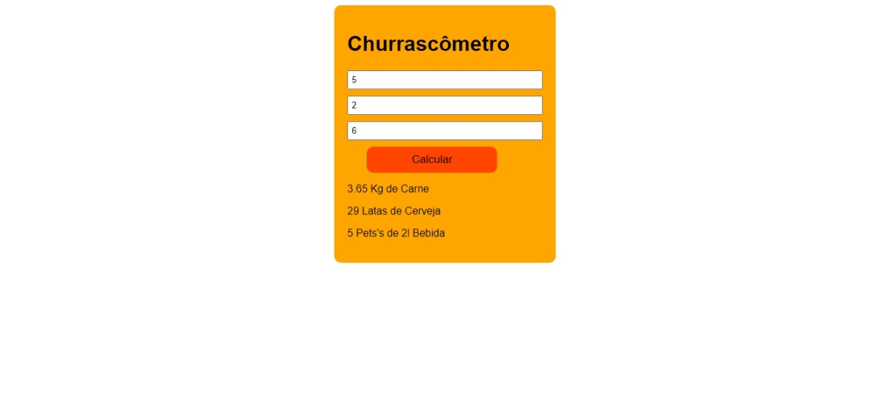

# Projeto-Churrascometro

##Funçoes do projeto
Esse Projeto consiste em um Calculo de Quanto o Usúario precisa gastar com carne bebida e refrigerante

## Aprendizagem

O projeto utiliza funçoes e elementos do doom E eventos de mouse 

##Tecnologias Utilizadas

*HTML5
*CSS3
*JavaScript

